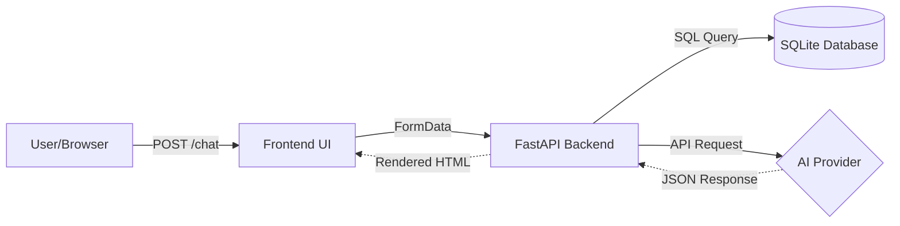

# Resume Helper Chatbot

## Project Overview
This project is a full-stack AI-powered Resume Helper Chatbot. Its primary goal is to provide users with an intelligent tool to analyze their resumes against a technical database, identify skill gaps, and receive tailored advice. The system integrates a FastAPI backend, a responsive Bootstrap/HTML frontend, and supports both cloud-based (Gemini) and local (Ollama) AI models, all orchestrated via Docker Compose.


## Setup Instructions

### Prerequisites
* [Docker Desktop](https://www.docker.com/products/docker-desktop/) (includes Docker Compose)
* Git

### Local Setup
1. Clone the repository: 
   `git clone [YOUR_REPO_URL]`
2. Create a `.env` file in the root directory by copying the example:
   `cp .env.example .env`
3. Configure your environment variables in the `.env` file (e.g., `GEMINI_API_KEY`).
4. Change the ollama path at "docker-compose.yml" to your ollama path: "C:/Users/[computer-name]/.ollama:/root/.ollama"

## Usage
1. **Run the application:** `docker compose up --build`
2. **Access the interface:** Open `http://localhost:8000` in your web browser.
3. **Expected Workflow:**
   * Upload `.pdf` or `.txt` files using the attach icon.
   * Type a request such as "find skill gap" in the message box.
   * View the AI-generated analysis in the chat history.

## API / Function Reference
* **POST `/chat`**: 
    * **Endpoint**: `http://127.0.0.1:8080/chat`
    * **Payload**: `FormData` containing `prompt` (string), `model_choice` (string), and `files` (binary).
    * **Response**: `{ "response": "string" }`
* **Frontend Logic**: The `sendMessage()` JS function in `app.html` handles `FormData` construction, performs the `fetch` request, and dynamically updates the DOM to display chat bubbles.
* **Find Skill Gap**: By adding 1 to 5 resumes and upload into the chat, then type 'find skill gap' it will check the skill gap among your resumes and tech stack in db



## API / Function Reference

### Backend API
* **`POST /chat`**: 
    * **Endpoint**: `http://127.0.0.1:8080/chat`
    * **Payload**: `multipart/form-data` containing:
        * `prompt` (string): The user query.
        * `model_choice` (string): The selected AI model (e.g., `gemini-3.5-flash`).
        * `files` (binary): The uploaded `.pdf` or `.txt` resume files.
    * **Response**: `{ "response": "string" }` (containing formatted gap analysis).

### Frontend Logic
* **`sendMessage()`**: Constructs a `FormData` object, appends the user's message, selected model, and file binary data, then performs a `fetch` POST request. It handles DOM updates to show "typing" indicators and render the final chat bubbles.
* **`renderFiles()`**: Manages the UI state for attached files, allowing users to verify and remove files before submission.

### Service Interaction (Docker Network)
The frontend and backend services interact through the Docker virtual network.
1. **Request Flow**: The browser sends a request to the backend service via the mapped port (e.g., `8080`). 
2. **Container Routing**: The Docker host intercepts this request and routes it to the FastAPI backend container.
3. **Internal Discovery**: Inside the Docker network, containers communicate directly using service names, ensuring that the backend can process uploaded files efficiently before returning the JSON analysis to the frontend.

## Data / Assumptions
* **Input Expectations**: PDF files must be text-based (no image-only scans).
* **Data Flow**: User Input -> Frontend -> FastAPI Middleware -> `find_skill_gaps` Engine -> AI Provider -> JSON Response -> Frontend UI Rendering.
* **Simplifications**: The system uses a local SQLite database (`jobs_d3_eval.db`) to provide the technical skill pool for gap analysis.

## Testing
* **Frontend**: Manual testing performed via browser UI to verify file upload and chat rendering.
* **Backend**: Endpoints validated using standard HTTP POST requests via Postman/cURL.
To verify your backend API independently of the frontend UI, you can use the following `curl` command. Ensure you have a test file (e.g., `test.pdf`) in your current directory:

```bash
curl -X POST [http://127.0.0.1:8080/chat](http://127.0.0.1:8080/chat) \
  -F "prompt=find skill gap" \
  -F "model_choice=gemini-3.5-flash" \
  -F "files=@test.pdf"

```

* **Integration**: Ensured services communicate via the Docker virtual network.

## Limitations
* **Authentication**: Currently lacks user login/authentication features.
* **History**: Chat sessions are not persisted in a database; data resets on browser refresh.
* **Accuracy**: Skill extraction relies on the underlying LLM's capability and document parsing fidelity.

## Architecture Reflection
### Design Choices
I chose a decoupled microservices architecture to separate the frontend interface from the backend processing logic. By containerizing each service with Docker, I ensure that the application runs identically on any machine, eliminating "it works on my machine" issues. The backend leverages FastAPI for its asynchronous capabilities, which are essential when waiting for high-latency AI model responses.

### Trade-offs
While a monolithic architecture would have been simpler to build and deploy for a single developer, it would have tightly coupled the UI to the business logic. I prioritized **modular maintainability** over initial simplicity; while the setup overhead with Docker Compose was higher, it allows me to independently swap the frontend framework (e.g., to React) or upgrade the AI engine without modifying the core ingestion pipeline.

### Improvements
Given more time, I would:
1. Implement a persistent database (PostgreSQL) to store chat history, moving beyond the current in-memory stateless design.
2. Integrate a robust frontend framework (React/Vite) to manage component state more effectively than vanilla JavaScript.
3. Add a CI/CD pipeline for automated testing and cloud deployment.